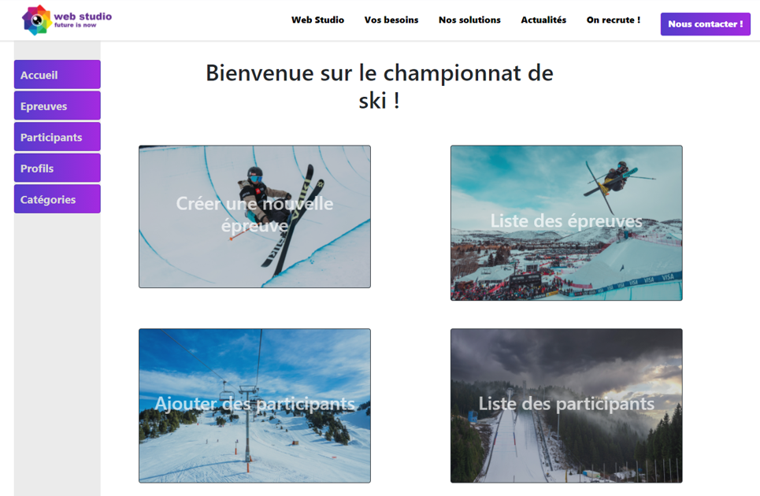
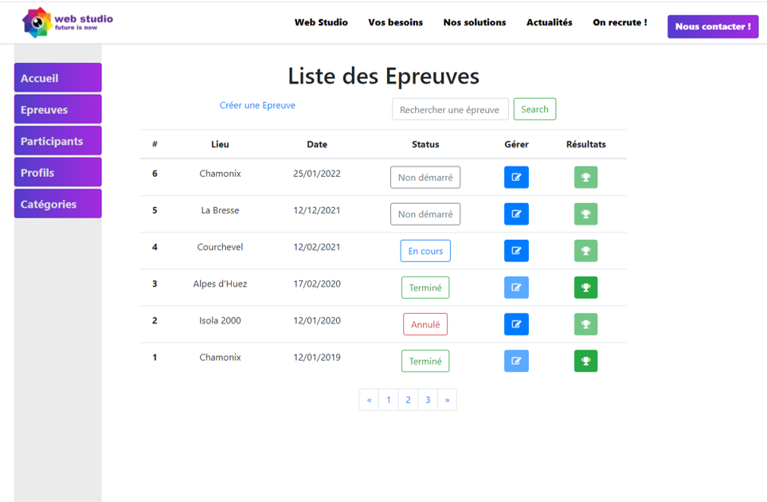
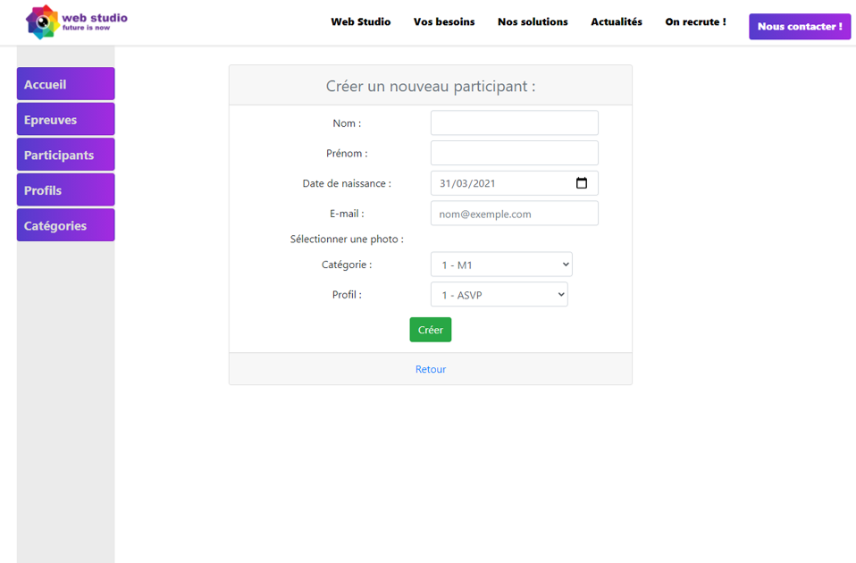
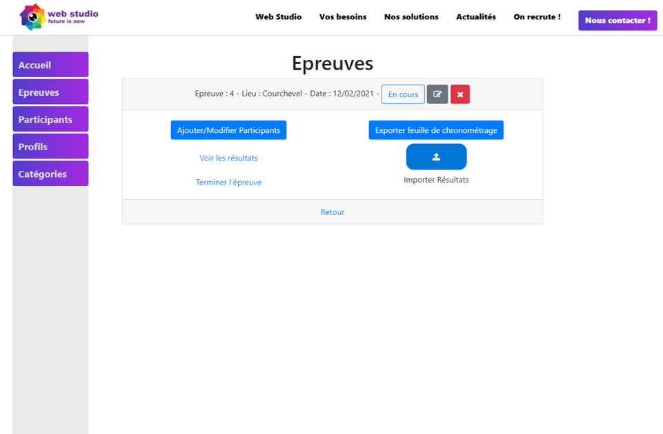
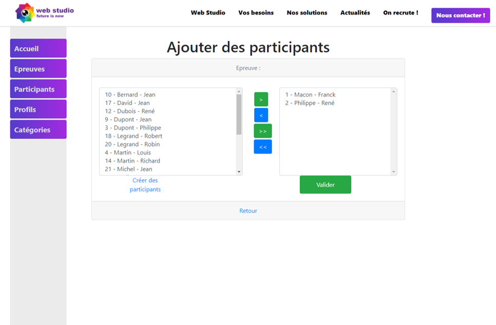
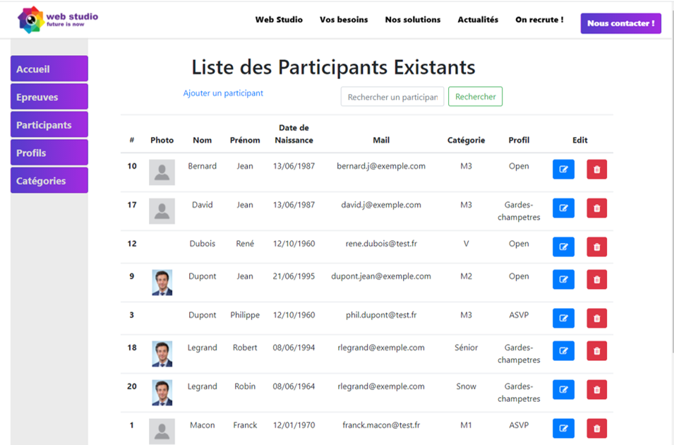
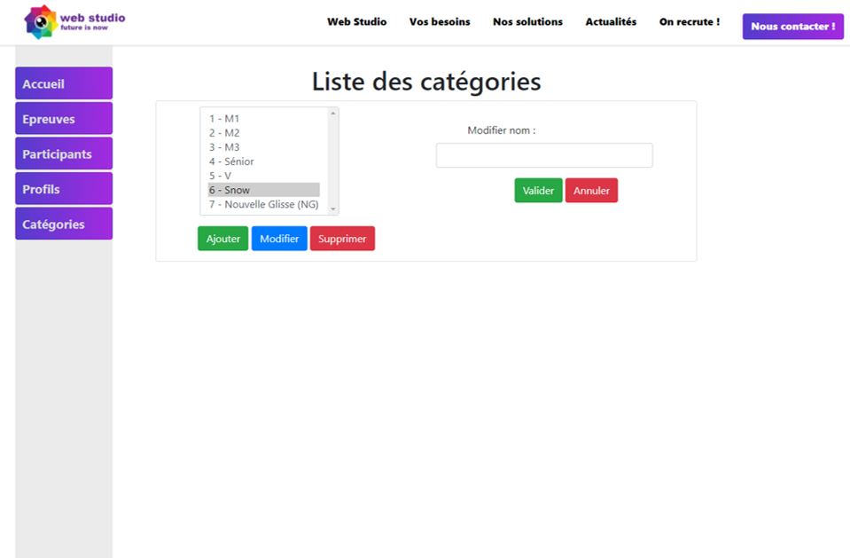
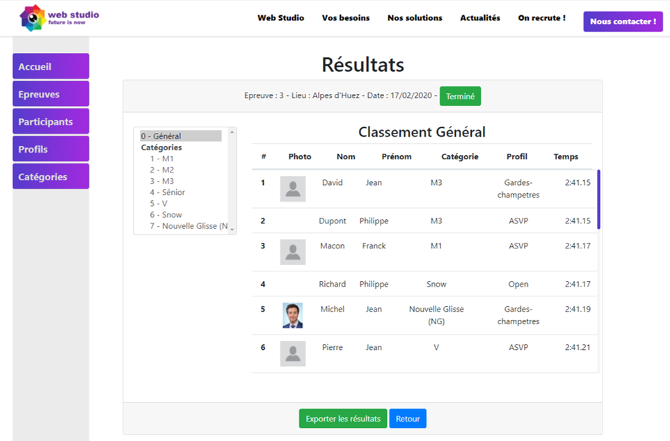
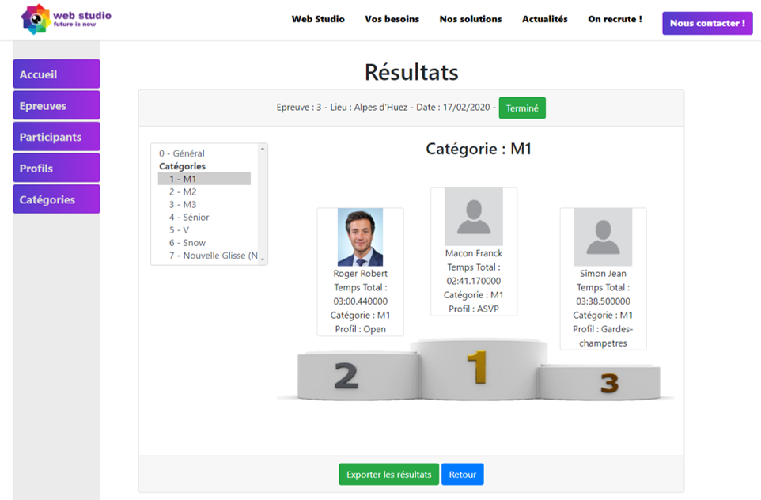

# Projet Championnat de ski / Ski Championship Manager

## Target : Create a desktop App to manage the different ski championships of French Police

## Objectif : Créer une application web pour gérer les compétitions de ski de la Police Française

---
Specifications : https://github.com/danielp67/Ski_Championship_Manager_PHP/blob/dev/data/specification_projet_logitud.pdf

Tools :

(for some components)

---
## Development Workflow :

### Phase 1 : Design graph and logic from 05-10-2020 to  09-10-2020

### Phase 2 : Initialization of the project and Entity creation with TDD from 12-10-2020 to 16-12-2020

### Phase 3 : Development of App with Controller, Router homemade, and Interface with Twig, from 19-10-2020 to 27-10-2020

### Phase 4 : Finalization with Excel file exportation and importation and styles from 27-10-2020 to 30-10-2020

---
## Overview :

### Home Page

### Race List Page

### Add New Participant Form

### Race Detail Page

### When you add some Participant for a Race

### Participant List Page

### Category and Profile List Page

### Result Page

